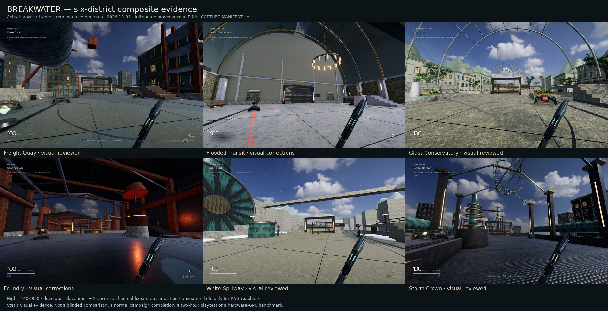

# BREAKWATER validation

## Result and acceptance limits

BREAKWATER has a playable start-to-ending campaign, persistence, chapter replay,
combat, progression, secrets, settings and audio. The checks below found and
repaired functional defects in the actual runtime.

**The original brief is not fully met.** Independent reviews do not rate the
environments as photorealistic or comparable to modern AAA productions. A normal
two-hour first playthrough has not been established. Assisted encounter samples
are much shorter than the design targets. The game should therefore remain a
review build, without claims of perfection, commercial superiority, or verified
minimum duration.

There are 25 sectors across six districts, 76 arenas, 144 ordinary waves,
714 ordinary opponents, seven bosses, 25 optional refuges and twelve skills.
These are content counts, not measurements of enjoyment or playtime. There are
no artificial waiting requirements or mandatory replays to inflate duration.

The [recorded evidence](breakwater-evidence/README.md) retains the raw reports,
including diagnosed transport notices and testing limitations.

## Environment and method

Checks ran in the cloud using Node 22, Playwright and Chromium 151. WebGL 2 was
provided by ANGLE/SwiftShader, a software renderer; no hardware GPU was available.
Functional checks used reduced rendering quality. Final environment captures used
1440 × 900 and High quality, including antialiasing, bloom and contact occlusion.
Those captures are real game frames, not generated concept art.

Long integration checks use the explicitly documented `?dev=1` bridge. Where
travel, exact aim, timing, invulnerability or enemy health were controlled, the
relevant script and report say so. Such checks do not count as normal playthroughs.
Ordinary public URLs do not install that inspection bridge.

## Functional evidence

| Area | Result | What the evidence establishes |
| --- | --- | --- |
| Player and weapon | 10 regression cases passed | Ceiling impacts, prop-top landing, thin-wall dash collision, respawn resets, near-wall throws, charge thresholds, catch cleanup, and reserved skill effects use the real modules. |
| Combat | 22 regression cases passed | Close-range enemies reach the player; boss counters, reflected shots, phase changes, cover pursuit, warning timing, short-segment weakpoints and Undertow exclusions work. |
| Actual input | Browser checks passed | Real New game click/pointer lock, WASD and mouse look, jump/dash/slide, charged mouse release/recall, keyboard constellation purchase, pause, settings and reload/Continue. |
| Public route | All 5 checks passed | New game, Escape, Resume and constellation return use the ordinary URL without the development bridge. This covers a pointer-lock promise/event race found during release verification; no missing assets, page errors or third-party requests were recorded. |
| Traversal | 52 checks passed across all 25 sectors | The actual player physics traversed the main routes and entered, collected and exited every secret without requiring upgrades. This used a navigation controller rather than human route finding. |
| Campaign state | All 25 sectors passed | All 76 checkpoints, seven boss IDs, sector transitions, death/Retry, saved progress, completed-chapter replay and the ending are exercised through the running game. Defeats and travel are controlled; difficulty and duration are not established by this suite. |
| Progression | All 12 skill effects exercised | Each skill changes its advertised movement, weapon or combat behavior. The final Undertow change also has displacement and range/cover/heavy-target negative cases. |
| Accessibility | Menu and constellation audits passed | No serious/critical axe violations in the tested states; real keyboard focus, purchase and return actions worked. This is not a claim that first-person gameplay is accessible to every player. |
| Assets | Source and browser verification passed | Seven model templates and all 33 prop files loaded with verified bytes and SHA-256; textures, HDR, fonts, audio and software retain local licence/source records. |
| Audio | Numerical WebAudio checks passed | Six district arrangements, 14 recorded samples, voice bounds, mute/pause/ending feedback and the underwater transition were checked. No subjective listening approval is claimed. |
| Website | Preflight passed | Generated hubs contain 32 games; all 53 public routes pass smoke checks and every catalog image tier matches its master. |

Some Chromium runs emitted `ERR_ABORTED` for Three.js streaming requests even
though the entire response decoded successfully. These notices were retained.
They were classified as non-fatal only when the observed complete bytes matched
the source SHA-256 and the corresponding HDR/model was confirmed in the ready
world. The raw visual run and its follow-up diagnosis remain in the evidence.

The underwater filter reduced a 4 kHz test tone by approximately 28 dB while
preserving low-frequency content. Returning to air restored the original level;
UI feedback remained on its separate, unfiltered bus. The audio script also
produces a six-second WAV for human listening.

## Boss completion samples

These are baseline-equipment fixtures using actual keyboard/mouse actions,
assisted exact aim and highly precise reactions. The engine advanced at fixed
60 Hz while rendering was held. Health, damage, armor and skills were not altered.
Earlier encounters were skipped to isolate each boss. Times include spawn/setup
and are **simulation samples, not expected human completion times**.

| Boss | Seconds | Executed attacks | Player health at victory |
| --- | ---: | ---: | ---: |
| Counterweight | 22.22 | 6 | 100 |
| Switchman | 24.17 | 6 | 85 |
| Glasskeeper | 22.42 | 5 | 92 |
| Crucible | 26.17 | 4, plus 3 successfully interrupted heat attacks | 100 |
| Floodgate | 33.97 | 7 | 90 |
| Warden | 26.17 | 6 | 84 |
| Heart | 34.17 | 8 | 67 |

All seven reached all three phases and were defeated. Their distinct counters
include an exposed post-slam return line, missed-charge brakes, reflected lens
shots, interrupted heat vents, jumped pressure rings, precision-shot reflection,
and a final combination of anchors, cables and surges.

These fast clears are an explicit reason not to treat the authored 129-minute
sum as proof of the two-hour requirement. No full unassisted human run was measured.

## Visual review

Independent reviewers inspected the six districts and compared selected views
with official publisher screenshots from [Dying Light 2](https://store.steampowered.com/app/534380/)
and [Ghostrunner 2](https://store.steampowered.com/app/2144740/) at
comparable image sizes. This was an **unblinded qualitative comparison**, not an
experiment or an objective ranking. Commercial reference images are review-only
and are not included in the game assets.

The reviewers found coherent amber route lights, red enemy optics, a cyan weapon,
a restrained interface, and distinct district landmarks and palettes. Foundry's
warm lighting and the Crown's copper structures were the strongest compositions.
They also identified broad sparse floors, repeated barred gates and side stairs,
regular window grids, simple machinery silhouettes and insufficient natural and
architectural detail. The commercial references were decisively ahead in visual
realism. Static captures cannot establish fast-motion readability or smoothness.

The final focused repairs remove a sliced Transit roof intersection, give service
doors physical frames and fittings, reduce Foundry stair striping, and improve
secondary HUD contrast over pale floors. These fix specific defects; they do not
close the larger production-quality gap.



## Reproduction

See [development instructions](breakwater.md) for the local server and environment
variables. The portable suites are in `build/qa/breakwater/`:

```sh
node build/qa/breakwater/regression.mjs
node build/qa/breakwater/combat-regression.mjs
node build/qa/breakwater/public.mjs
node build/qa/breakwater/campaign.mjs
node build/qa/breakwater/bosses.mjs
node build/qa/breakwater/audio.mjs
node build/qa/breakwater/experience.mjs
node build/scripts/preflight.mjs --art
```

Hardware GPU performance, an ordinary two-hour playthrough, gamepad/touch play,
and subjective audio quality remain unverified. The supported gameplay controls
are keyboard and mouse on a desktop WebGL 2 browser.
