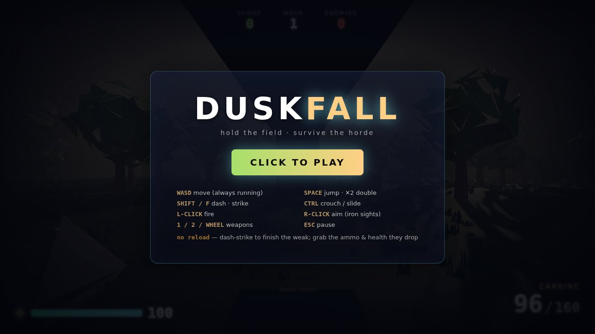
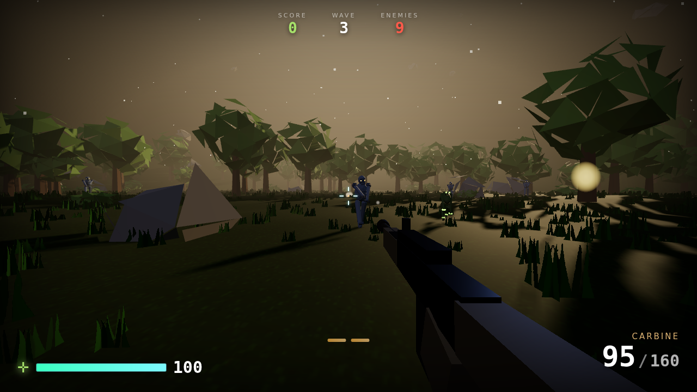
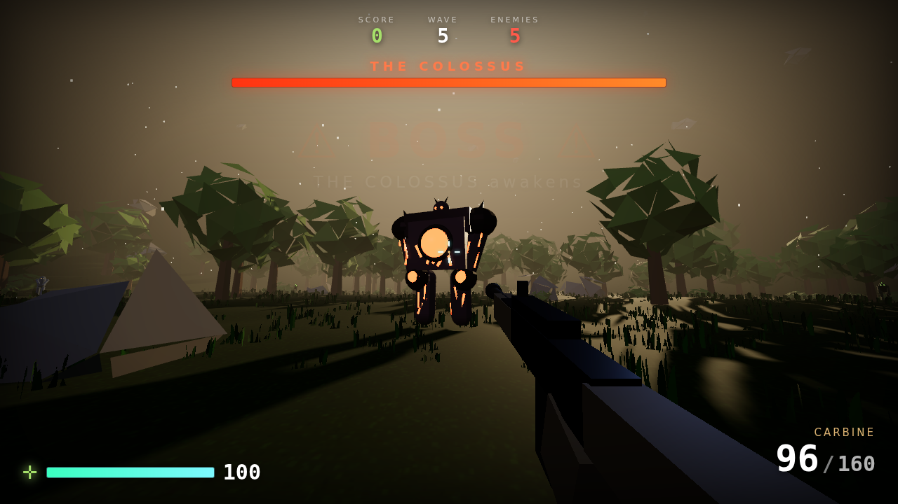

# DUSKFALL

A browser-based horde-survival FPS set in one golden-hour meadow. Run the field,
chain kills, and hold back wave after wave of the advancing horde. Built around a
single goal: **stylish, atmospheric 3D that plays like the smoothest shooter you've
ever touched.** No engine, no build step — just Three.js and vanilla JavaScript
modules. Open it and play.



## Play

It needs to be served over HTTP (ES modules don't load from `file://`):

```bash
# from this folder:
python3 -m http.server 8080
# …or any static server
```

Then open **http://localhost:8080** and click **CLICK TO PLAY** (this grabs your
mouse).

> Three.js and its post-processing addons are vendored in `vendor/` so the game
> runs **fully offline** — no CDN, no network.



## Controls

| | |
|---|---|
| **WASD** | move — you're **always running** at full speed |
| **Mouse** | look · **Left click** fire · **Right click** aim (iron sights) |
| **Space** | jump — press again in the air for a **high double jump** |
| **Shift / F · Mouse4/5** | **dash** — a fast i-frame lunge on regenerating charges; in the air it lifts you, so you can chain jumps + dashes to soar. **Dash into an incoming snowball to bat it back.** |
| **Q / middle-mouse** | **slow-mo** — bend time from a regenerating meter (deadly in the air) |
| **G** | **throw a grenade** — a powerful arcing frag (small stock, rare drops, never self-harms) |
| **the sky RING** | a connected loop of islands in the sky — double-jump (it's HUGE now) + air-dash up, mantle any ledge, then run the whole loop |
| **the underground** | drop down any of the four **sinkhole craters** into the tunnels + the great cavern; jump/dash back out the same way |
| **the pond** | wade straight through it (splashy footsteps); in deep winter it **freezes over** — slippery ice, and whatever was wading gets encased |
| **Ctrl / C** | crouch · **run + crouch** = slide |
| **1 / 2 / wheel** | switch weapons (carbine · fast combat shotgun) |
| **after each wave** | **pick 1 of 3 upgrades** (click a card or press 1/2/3) — they stack all run |
| **Esc** | pause |

**There is no reload.** DOOM-style: your ammo only comes from what enemies drop and
from **dash finishers**, so you have to stay aggressive to stay armed and alive.

**On mobile** it auto-switches to touch controls: a floating left-stick to move,
drag the right side to look, and on-screen **FIRE / JUMP / DASH / AIM / pause** buttons.

Survive escalating waves. Score points, chain your combo, don't die. Your best run
is saved locally and shown on the menu.

## The look

DUSKFALL goes for *stylish realism* — a warm, cinematic late-afternoon rather than
a photo. The whole scene is generated at load, then run through a filmic camera:

- **Atmospheric-scattering sky** (Preetham model) with the sun sitting low and
  golden, driving a matching warm directional key light, a cool sky-fill
  hemisphere, and a soft bounce.
- **Procedural terrain** — rolling noise-based hills you can actually walk, ringed
  by a forest that hems in the arena. Grass, dirt and rock are blended by slope and
  height, with alpha-tested grass tufts and a subtle detail texture.
- **Instanced foliage** — hundreds of low-poly trees, rocks and bushes scattered
  with a density that thins toward the middle and thickens into a treeline, drawn
  in a handful of instanced draw calls.
- **THE GREAT TREE.** A giant oak towers over the middle of the map and the
  whole sky layer is its crown: spiral branch steps climb to a plank **treehouse
  deck** holding the **loot cage** (drops from fights below still funnel up into
  it), and the canopy above is a high perch. Nothing floats unsupported any
  more — every platform in the sky hangs off this tree.
- **THREE LAYERS.** The world is a sandwich now. **The sky**: a **canopy
  village** strung through the great tree — a loose, irregular ring of big flat
  plank **decks** (each braced by a limb from the trunk and a support post to
  the ground, so nothing floats) joined to each other and back to the tree by
  rope-and-plank **bridges**. The decks have **railings** so you can plant your
  feet and shoot without stumbling off the edge — but the railing opens into a
  doorway wherever a bridge meets it, and a jump or air-dash always clears it,
  so deliberate leaps are never blocked. Walk the loop, cross a bridge to cut
  through the middle, or air-dash between decks.
  **The surface**: real rolling hills and a pond you wade through — which freezes
  into slippery ice in deep winter (with a freeze set-piece that encases anything
  caught wading). **The underground**: four sinkhole craters funnel down into
  tunnels that meet in a huge crystal-lit cavern under the middle of the map;
  descending drowns the daylight and closes the fog in dark. One layer-aware
  ground function drives the player, enemies, pickups and projectiles, so
  walkers chase you down the sinkholes and back up, flyers circle the holes,
  and nothing shoots through rock.
- **A filmic pipeline** — everything renders into an HDR multisampled buffer, gets
  a restrained bloom on genuinely bright highlights (the sun, tracers), then ACES
  tone-mapping and sRGB output. Hazy fog, drifting dust motes, and long shadows sell
  the golden hour.
- **The viewmodel** is drawn in a separate depth-cleared overlay pass so the gun
  never clips into the world — a hallmark of a polished FPS.
- **A world past the fence.** The arena sits in a real valley now: the rim of
  highlands is capped so genuine sky shows above it, with **two rings of hazy
  mountain silhouettes** layered behind it (fog-exempt, hand-tinted per season —
  the classic matte-painting trick), **drifting procedural clouds**, and
  **fireflies** wandering the meadow at golden hour that die back as winter
  comes. The grass **sways** in the wind (a tiny vertex-shader injection).
- **Sinkhole DOORWAYS.** Every descent into the underground is now a built
  entrance, not a hole in the dirt: a heavy stone **archway** with leaning
  pillars, a glowing keystone rune and flanking **torches** faces the arena, a
  carved ring of kerb-stones lips the mouth, and stone **steps** lead down into
  the dark — plus the tall amber **glow column** so you spot the way underground
  from across the field.
- **Rocks to bound across.** Weathered boulders and rock shelves are scattered
  in loose routes over the meadow — ordinary geology to look at, but their
  heights and spacing are tuned so a **jump + air-dash chains you rock-to-rock**
  across the field, or vaults you up toward the canopy. Each is a stand-able top
  and solid cover.
- **Solid foliage.** Trees, bushes and rocks are watertight lumps now (the old
  per-vertex jitter tore polyhedron corners apart into floating shards full of
  holes); canopies also carry a dark inner core so they read dense from every
  angle.
- **Standing stones.** Three megalithic landmarks give fights geography: **the
  Henge** (a ring of stones with two mantle-able fallen lintels and an altar
  hop-up), **the Arch** (dash under it, fight on top of it), and **the Sleeper**
  (a half-buried monolith that ramps you up to a perch). They block movement and
  line-of-sight — orbit a fight around them, bait charges into them, or hold
  their tops.

## Seasons & dread

The meadow doesn't stay golden. As you climb the waves the world **turns through
the year and slowly rots** — a little more each level, and it never resets mid-run:

- **Summer → autumn → winter.** The sky thickens and cools, the sun sinks and pales,
  the fog draws in, and the foliage shifts from summer greens to burnt autumn golds to
  a bleached winter. Snow creeps down onto every upward-facing surface (a GPU normal
  mask, so it costs nothing), the grass dies back, and eventually **snow falls** across
  the whole field, thickening into a **storm** by the final stretch.
- **The haunting.** Underneath the season, the light curdles — key light dims, the fog
  turns sickly, exposure drops — so the same meadow that felt warm at wave 1 feels
  wrong and cold by the end.
- **Adaptive audio.** There was no music before; now a layered score runs under the
  whole game — a drone bed, a tension shimmer, and a combat pulse that swells with the
  danger on screen (enemy count, bosses, low health) and whose **mood darkens with the
  season**. Enemy voices are pitched per creature type so a crowd sounds like a crowd,
  and the weapons hit with punchier, layered reports.

## The feel

Game feel is the sum of a hundred small responses. The big ones here:

- **Movement** — Quake/Source-style ground/air acceleration on a rolling heightfield.
  You're **always running** at top speed, with strong air-strafe control, coyote time,
  jump buffering, a variable-height jump, and a momentum-preserving crouch-slide.
- **Air game** — this is the star. High jumps plus a big **double jump**, and a dash
  that runs on **two regenerating charges** and, in the air, **launches you upward**.
  So you can chain **jump → air-dash → air-dash** to soar high and float clear across
  the field — a long, expressive, weightless traversal that turns every fight into a
  movement playground.
- **Dash & jump-dash** — a fast lunge in your move direction (ground *or* air) with
  brief **i-frames**, a big FOV punch, camera roll, radial speed-lines, a whoosh and
  a dust kick. On the ground it hops you forward; in the air it lifts and carries you.
  It's a dodge, a traversal tool, *and* a weapon.
- **Dash strike — skewer or crunch** — a dash carves a **wide bubble**, so you still
  cleave a whole crowd in one lunge (i-frames keep you safe). But it no longer just
  phases: a **kill** yanks the corpse to a point right in front of your face, drags it
  with the lunge, then **detonates it in view** — you *see* what you killed. A survivor
  you dash into **body-checks** you to a mass-scaled rebound stop (never a phase-through;
  air-dashes keep their arc). Catch one **low on health** and it's a **FINISHER** — gold
  flash, slow-mo, bonus points, and a refill of **ammo + health**.
- **The VOID ORB** (press **G**) — the throwable stopped being a worse gun and
  became a crowd-shaping superpower: the orb arcs, bounces, then **blooms into a
  singularity** that drags every non-boss enemy in a wide radius into one
  screaming, helpless knot — floated off their feet — and then **detonates the
  packed ball**. It's a panic button when you're cornered *and* a combo setup:
  vacuum the pack, then meet it with a shotgun blast or a dash-skewer. It still
  **never hurts you**. Refilled by rare drops; a HUD counter tracks them. (The
  vortex used to stutter on weaker machines — its flash-lights were toggling
  visibility every frame, which forces the renderer to recompile every material;
  the pooled lights now hold a constant count, so it runs smooth.)
- **Roguelite upgrades** — clear a wave and the field freezes for a **choice of three
  stacking upgrades**. Odd waves boost capacity (max health / slow-mo duration / max
  ammo); even waves boost your **drop rates** (ammo / health / grenades). A run compounds.
- **No reload — feed on the horde** — there's no magazine and only a trickle of passive
  regen. Every weapon draws from one pool that refills from enemy **ammo/health drops**
  (adaptive: more health when you're hurt) and from dash finishers. Glowing pickups
  magnetise into you. Push forward or run dry.
- **Iron sights** — hold right-click to bring the gun up, zoom in, tighten your spread
  and steady your aim (it drops you to a walk and calms the bob). Raising sights breaks
  your run; dashing breaks your sights.
- **A supply drop you can't miss** — the mid-wave supply event now slams a
  **crate** onto the field under a tall cyan **light beam**, and paints a **HUD
  waypoint** (distance readout on-screen, an arrow pinned to the edge when it's
  off-screen or behind you) — so you always know exactly where to run. Reach it
  and it cracks open, spilling ammo, health and a grenade.
- **3D positional audio** — every enemy voice is placed in the world now, not
  just panned left/right: an HRTF listener rides the camera, so you hear a growl
  **behind** you, a raven shrieking **above**, a charge closing from the **left**,
  and threats **fade with distance**. You can fight by ear.
- **Snappy shooting** — the shotgun fires faster, and a nasty hitch is gone:
  bullets used to raycast the 13k-triangle terrain mesh (×12 per shotgun blast,
  a ~125ms freeze). Now they march the heightfield analytically and only raycast
  props/enemies, so firing is smooth.
- **Gunplay** — hitscan with spread "bloom" that grows while you fire and move. Every
  shot drives recoil, an FOV punch, screen shake, a muzzle flash + light, a tracer,
  spark burst and a spinning brass casing. Headshots hit harder. Carbine + shotgun.
- **Impact** — enemies flash on hit, snap back, spray signature-coloured blood, and
  crumple through a scripted death. Meaty hits trigger a micro hit-stop; wiping out a
  threat dips the world into a brief kill slow-mo (which the real-time dash cuts right
  through — you glide past frozen enemies).
- **Arcade scoring** — a combo multiplier climbs as you chain kills without missing,
  headshots and finishers pay bonuses, and clearing a wave pays out.

## The horde

Waves drip-spawn from the treeline and close on you from all sides. Five wildly
distinct creatures — each its own silhouette, size, signature colour, glowing
emissive accents (so you read them at a glance and they pop against the dusk),
signature-coloured blood, and its own gait and behaviour:

- **Husk** — ashen foot-soldier with amber eyes. The steady marcher; the backbone
  of every wave.
- **Stalker** — small, fast, hunched raptor-thing lit toxic green. Weaves as it
  runs and lunges the last few metres. Packs **flank** now — each one commits to
  a curving left or right arc instead of beelining, so a group envelops you.
- **Juggernaut** — a towering charcoal tank with a molten-red core and cracks.
  Slow and relentless; the ground shakes when it walks and shrugs off knockback.
  Past mid-run it learns the **bull charge**: it rears back (that's your tell),
  then rushes in a locked straight line that tramples for heavy damage — but bait
  it into a tree, a rock or a standing stone and it **crashes and stuns itself**
  for a long, punishable beat. The obstacles are your matador's cape.
- **Wisp** — a legless hovering specter glowing cyan. Bobs and drifts over the
  terrain, unravelling into light when killed.
- **Bloater** — a bulbous pustular sack glowing orange. Waddles in and **ruptures**
  on death in a second, larger burst that hurts you up close. Get within arm's
  reach and it **arms itself** — a fast accelerating flash, then it detonates on
  its own. Kill it at range or dash *through* and out of the blast.
- **Raven** — a dark-violet carrion bird with swept, magenta-lit wings. It **flies**,
  climbing to the sky-islands and diving at you — so getting airborne is no escape.
- **Seer** — a hovering violet caster that holds a high **standoff and snipes** you
  with charged bolts from above (its eye glows as it winds up — read it and dodge).
  Perches by the islands after the first few levels.
- **Megalith** — a walking stone monolith, moss-seamed and rune-lit, orbited by
  slow pebbles. The heaviest non-boss in the game and nearly unpushable, but
  *very* slow — a zoner, not a chaser. Its stomp sends an expanding **quake
  ring** rippling across the ground that punishes anyone standing on it: jump,
  dash, or be airborne when the ring passes. It's the enemy that forces you to
  play the air game.

### Elites

From wave 4 on (and guaranteed on certain mutator waves), any regular creature
can spawn **elite** — tinted to its affix, crowned with a spinning sigil, over
twice as tough, and always worth a drop:

- **Blazing** (orange) — detonates on death, scorching everything within arm's
  reach. Don't dash-kill it in your own face.
- **Frost** (pale blue) — barely flinches from knockback, and its hits **chill**
  you to half speed for a beat. Getting tagged in a crowd is how you die.
- **Volatile** (violet) — death flings a fan of live bolts outward. Kill it,
  then move.
- **Gilded** (gold) — no tougher than normal, but worth **2.5× score** and extra
  loot. A moving jackpot: prioritise it before the wave ends.

### No two waves alike

Past the first couple of waves, each non-boss wave has a good chance of rolling a
**named mutator** (never the same one twice in a row) — the wave banner tells you
what you're in for: **SWARM** (a flood of weaker enemies, spawning fast),
**ELITE MARCH** (fewer, but every one an elite), **ROLLING FOG** (the fog closes
in and the horde hurries), **NIGHTFALL** (the light dies to a murky gloam),
**FALLING SKY** (light meteors rain across the whole field all wave), and
**BOUNTY** (gilded elites everywhere — a score rush). On top of that, once per
wave, a **mid-wave surprise** fires: either a reinforcement surge pours in at
your flank, or a **supply beacon** flares and drops a cache of ammo, health and
grenades — a little director's hand on the pacing, so the middle of a wave never
goes flat.

**Every creature glows.** All grounded enemies carry **magma-vein cracks** in
their hide, lit in their signature accent colour — so the horde reads at a
glance across fog, NIGHTFALL waves, and the underground dark. And nothing gets
stuck any more: underground enemies path up and OUT of the sinkhole craters
(they used to pool at the bottom of the bowl), and a stall watchdog quietly
re-drops any wedged straggler at the arena edge.

The roster unlocks and its mix ramps as the waves climb. A **pressure spawner**
keeps a steady crowd bearing down on you and refills it as you cut them down, so
the action never sags into a lull. When only one enemy is left it goes **berserk**
— faster, hitting harder, charging straight at you, and marked by a tall glowing
beacon you can spot across the whole field, so you never have to hunt the last
straggler.

## Bosses



Every fifth wave the horde parts for a **boss** — the roster rotates
**Colossus → Yeti → Wurm → Tempest**, each owning a different layer:

- **THE COLOSSUS** — a five-metre molten titan with an exposed glowing core, horns
  and shoulder spikes, wrapped in lava cracks. It stomps the ground (each footfall
  shakes the screen), winds up a telegraphed **ground-slam** with an area shockwave,
  and periodically **calls in reinforcements**. A dedicated health bar tracks it.
- **THE YETI** — the deep-winter finale. A **seven-metre frost titan** of shaggy
  fur and ice shards that arrives in a **whiteout blizzard** (it whips the storm up
  itself). It hurls **giant snowballs** on a telegraphed wind-up, slams anyone who
  closes in, and summons **ravens** to hound you from the sky. The trick: **dash into
  an incoming snowball to bat it back** — a reflected snowball rockets home and
  **staggers it for massive damage**. Guns alone are slow; the reflect is how you win.

- **THE WURM** — the underground's boss. Meteors scour the surface for the whole
  wave, forcing you DOWN into the cavern with it: a segmented magma-seamed
  serpent that burrows (bullets can't reach it through rock), telegraphs with a
  rumble + dust ring, then **erupts in an arc under your feet** — its exposed
  body is the damage window; the eruption is the thing you dodge.
- **THE TEMPEST** — the sky's boss. The open ground **surges with storm-charge**
  (standing on it drains you fast — dash i-frames carry you across), so you live
  on the ring and the islands while it orbits at your altitude, volleys bolts,
  and periodically dives straight through your position.

Dodge the slam with your dash i-frames, chip a boss down (their high health shrugs
off a finisher), and when one falls it goes out in a chain of explosions, a slow-mo
beat, a huge score payout, and a pile of guaranteed ammo + health. Their health
scales up each time you meet one.

## Structure

```
index.html          importmap + canvas + boot
styles.css          HUD / menu styling
src/
  main.js           game loop, wiring, arcade scoring
  engine/           input, audio, math, FX (particles/shake/hitstop/slow-mo)
  gfx/post.js       HDR + bloom + tone-map composer
  world/            terrain, instanced foliage, sky + lighting + motes
  player/           terrain-following controller + camera rig
  weapons/          weapons + procedural viewmodels
  enemies/          procedural humanoid horde + wave manager
  ui/hud.js         HUD, menus, score pops, wave banners
vendor/             Three.js + addons (vendored for offline play)
```

No dependencies to install, no bundler, no framework. Just open it and hold the
field.
